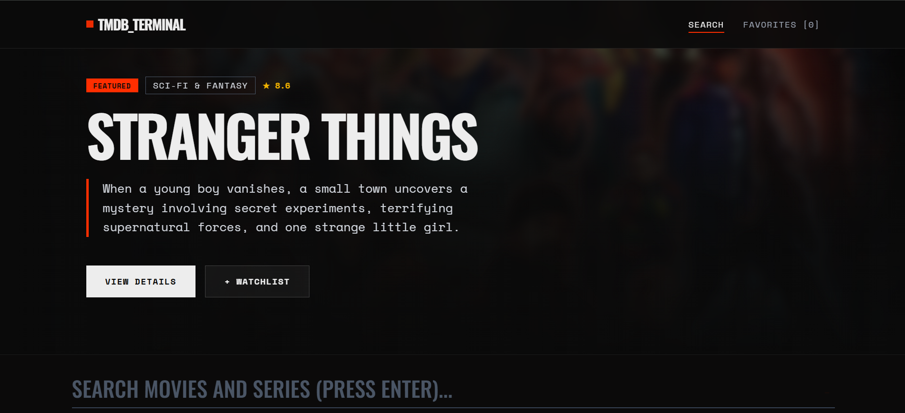
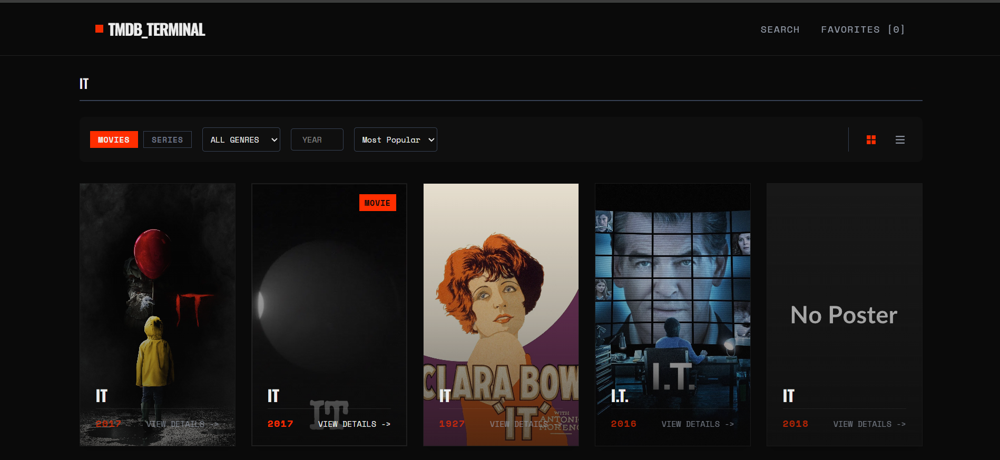
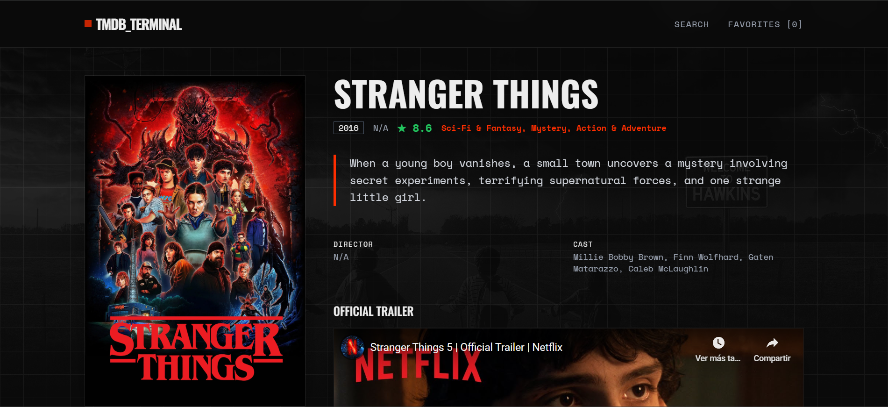
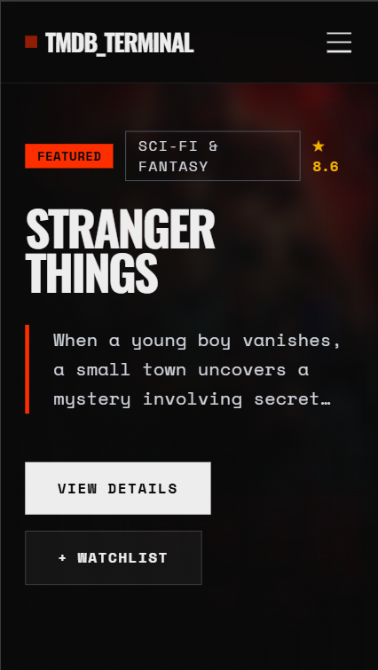
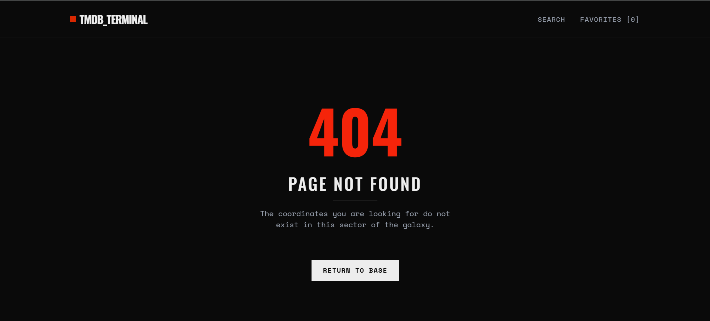

# TMDB Terminal

**Explorador de Cine y Television**


---

## Tabla de Contenidos

1. [Descripcion General](#descripcion-general)
2. [Capturas de Pantalla](#capturas-de-pantalla)
3. [Decision Tecnica: TMDB vs OMDb](#decision-tecnica-tmdb-vs-omdb)
4. [Caracteristicas Principales](#caracteristicas-principales)
5. [Stack Tecnologico](#stack-tecnologico)
6. [Arquitectura del Proyecto](#arquitectura-del-proyecto)
7. [Instalacion y Configuracion](#instalacion-y-configuracion)
8. [Variables de Entorno](#variables-de-entorno)
9. [Scripts Disponibles](#scripts-disponibles)
10. [Estructura de Directorios](#estructura-de-directorios)
11. [Componentes Principales](#componentes-principales)
12. [Custom Hooks](#custom-hooks)
13. [Servicios](#servicios)
14. [Optimizaciones de Rendimiento](#optimizaciones-de-rendimiento)
15. [Accesibilidad](#accesibilidad)
16. [Responsividad](#responsividad)
17. [Despliegue](#despliegue)
18. [Decisiones de Diseno](#decisiones-de-diseno)
19. [Licencia](#licencia)
20. [Autor](#autor)

---

## Descripcion General

**TMDB Terminal** es una aplicacion web moderna para la exploracion, busqueda y gestion de peliculas y series de television. Desarrollada como parte del **IEEE ESTl Frontend Hackathon 2025**, esta aplicacion implementa una arquitectura modular basada en componentes con React 19, gestion de estado mediante Context API, y una estetica visual inspirada en terminales retro con un toque cinematografico contemporaneo.

La aplicacion permite a los usuarios:

- Explorar contenido en tendencia actualizado semanalmente
- Buscar peliculas y series con filtros avanzados
- Visualizar informacion detallada incluyendo trailers, reparto y titulos similares
- Gestionar una lista de favoritos persistente
- Alternar entre modo claro y oscuro

**URL de Produccion:** [movie-finder-tau-eight.vercel.app
](https://movie-finder-tau-eight.vercel.app/)

**Repositorio:** [https://github.com/Juliocpo946/movie-finder](https://github.com/Juliocpo946/movie-finder)

---

## Capturas de Pantalla

### Pagina Principal (Home)



*Vista principal con hero dinamico, barra de busqueda prominente y secciones de contenido trending y popular.*

---

### Pagina de Busqueda



*Resultados de busqueda con filtros avanzados por tipo, genero, anio y ordenamiento. Incluye toggle para vista grid/lista.*

---

### Pagina de Detalle



*Vista detallada con poster, informacion completa, trailer embebido de YouTube y seccion de titulos relacionados.*

---

### Vista Movil



*Diseno responsive adaptado para dispositivos moviles con navegacion hamburguesa y componentes optimizados.*

---

### Pagina 404



*Pagina de error personalizada con diseno consistente y navegacion de retorno.*

---
## Decision Tecnica: TMDB vs OMDb

Este proyecto implementa **TMDB (The Movie Database) API** como fuente principal de datos. Esta eleccion esta **explicitamente contemplada en las reglas del hackathon**, donde se menciona en la seccion de "APIs Adicionales (Opcionales)":

> *"TMDB API: Como alternativa o complemento a OMDb"*

La decision de utilizar TMDB como API principal (en lugar de complementaria) se fundamenta en las siguientes limitaciones tecnicas detectadas en OMDb durante la fase de analisis:

### Limitaciones de OMDb

| Aspecto | OMDb | TMDB |
|---------|------|------|
| **Endpoints de Descubrimiento** | No disponible | `/trending`, `/discover`, `/similar` |
| **Calidad de Imagenes** | Baja/variable | Multiples resoluciones optimizadas |
| **Filtros Combinados** | Limitado | Soporte completo via `/discover` |
| **Cuota de Peticiones** | 1,000/dia | 40 req/10s (mas flexible) |
| **Datos de Videos** | No disponible | Trailers y clips de YouTube |

### Justificacion Detallada

Al estar TMDB listada como API permitida en las reglas oficiales del hackathon, se opto por utilizarla como fuente principal debido a:

1. **Endpoints de Descubrimiento:** OMDb carece de endpoints nativos para obtener "Trending" o "Titulos Similares". TMDB ofrece endpoints especificos que permiten una implementacion real sin datos estaticos.

2. **Calidad de Recursos Graficos:** La interfaz requiere posters y backdrops de alta resolucion. TMDB proporciona multiples tamanios optimizados (`w300`, `w500`, `original`).

3. **Capacidades de Filtrado:** El endpoint `/discover` de TMDB permite combinar multiples parametros (genero, anio, tipo, ordenamiento) en una sola consulta.

4. **Integracion de Trailers:** TMDB incluye datos de videos de YouTube directamente en sus respuestas, permitiendo embeber trailers oficiales sin necesidad de una segunda API.

Esta decision permite cumplir de manera mas robusta con los requerimientos de la rubrica, especialmente en los criterios de "Funcionalidades", "Creatividad" y "Experiencia de Usuario".

---

## Caracteristicas Principales

### Busqueda y Filtrado

- **Busqueda en Tiempo Real:** Custom hook con debouncing de 500ms para minimizar llamadas a la API
- **Filtros Avanzados:** 
  - Tipo de contenido (Pelicula/Serie)
  - Genero (18 categorias disponibles)
  - Anio de lanzamiento
  - Ordenamiento (Popularidad, Valoracion, Fecha)
- **Vistas Dinamicas:** Alternancia entre grid y lista con persistencia de preferencia
- **Paginacion Infinita:** Carga progresiva de resultados sin recarga de pagina

### Experiencia de Usuario

- **Diseno Responsive:** Mobile-first con breakpoints optimizados
- **Animaciones Fluidas:** Transiciones entre rutas y micro-interacciones con Framer Motion
- **Feedback Visual:** Skeletons de carga, indicadores de estado y mensajes de error claros
- **Tema Oscuro/Claro:** Deteccion automatica de preferencia del sistema con toggle manual

### Gestion de Contenido

- **Vista Detallada:** Sinopsis, reparto, director, metadatos tecnicos y trailer embebido
- **Sistema de Favoritos:** Persistencia en LocalStorage con conteo por tipo
- **Titulos Similares:** Recomendaciones basadas en el contenido actual
- **Compartir:** Funcionalidad nativa de Web Share API con fallback a clipboard

### Optimizaciones

- **Sistema de Cache:** Cache en memoria con TTL de 5 minutos para reducir peticiones
- **Cancelacion de Peticiones:** AbortController para evitar race conditions
- **Lazy Loading:** Carga diferida de imagenes con fallback a placeholder
- **Normalizacion de Datos:** Capa de abstraccion para estandarizar respuestas de API

---

## Stack Tecnologico

### Core

| Tecnologia | Version | Proposito |
|------------|---------|-----------|
| React | 19.2.0 | Biblioteca UI con hooks y componentes funcionales |
| Vite | 7.2.4 | Build tool con HMR ultrarapido |
| React Router DOM | 7.9.6 | Enrutamiento declarativo con layouts anidados |

### Estilos y UI

| Tecnologia | Version | Proposito |
|------------|---------|-----------|
| Tailwind CSS | 4.1.17 | Framework CSS utility-first |
| Framer Motion | 12.23.24 | Animaciones declarativas y transiciones |
| clsx + tailwind-merge | 2.1.1 / 3.4.0 | Utilidades para clases condicionales |

### Herramientas de Desarrollo

| Tecnologia | Version | Proposito |
|------------|---------|-----------|
| ESLint | 9.39.1 | Linting y estandarizacion de codigo |
| PostCSS | 8.5.6 | Procesamiento de CSS |
| Autoprefixer | 10.4.22 | Compatibilidad cross-browser |

### Tipografias

- **Oswald:** Titulos y headers (peso 500, 700)
- **Space Mono:** Cuerpo de texto y elementos UI (peso 400, 700)

---

## Arquitectura del Proyecto

```
Arquitectura basada en capas con separacion de responsabilidades:

+------------------+     +------------------+     +------------------+
|     PAGES        |     |   COMPONENTS     |     |     CONTEXT      |
|  (Vistas/Rutas)  |<--->|   (UI Atomica)   |<--->|  (Estado Global) |
+------------------+     +------------------+     +------------------+
         |                       |                       |
         v                       v                       v
+------------------+     +------------------+     +------------------+
|     HOOKS        |     |    SERVICES      |     |     UTILS        |
| (Logica Negocio) |<--->| (Cache/Storage)  |<--->| (Helpers/Const)  |
+------------------+     +------------------+     +------------------+
         |
         v
+------------------+
|       API        |
|  (TMDB Client)   |
+------------------+
```

### Flujo de Datos

1. **Usuario interactua** con un componente de UI
2. **Componente dispara** un custom hook
3. **Hook gestiona** la logica de negocio y llama al servicio de API
4. **Servicio de cache** verifica si existe data valida
5. **API Client** realiza la peticion si es necesario
6. **Respuesta normalizada** se propaga hacia arriba
7. **Context actualiza** estado global si aplica
8. **UI re-renderiza** con los nuevos datos

---

## Instalacion y Configuracion

### Prerrequisitos

- Node.js >= 20.19.0
- pnpm >= 8.0.0 (recomendado) o npm >= 10.0.0
- Cuenta en TMDB para obtener API Key

### Pasos de Instalacion

```bash
# 1. Clonar el repositorio
git clone https://github.com/Juliocpo946/movie-finder.git
cd movie-finder

# 2. Instalar dependencias con pnpm (recomendado)
pnpm install

# 3. Copiar archivo de variables de entorno
cp .env.example .env

# 4. Configurar variables de entorno (ver seccion siguiente)

# 5. Iniciar servidor de desarrollo
pnpm dev
```

La aplicacion estara disponible en `http://localhost:5173`

---

## Variables de Entorno

Crear un archivo `.env` en la raiz del proyecto con las siguientes variables:

```env
# API Key de TMDB (obtenida en https://www.themoviedb.org/settings/api)
VITE_TMDB_API_KEY=tu_api_key_aqui

# Access Token de TMDB (Bearer Token para autenticacion)
VITE_TMDB_ACCESS_TOKEN=tu_access_token_aqui

# URL base de la API de TMDB
VITE_TMDB_BASE_URL=https://api.themoviedb.org/3

# URL base para imagenes de TMDB
VITE_TMDB_IMAGE_URL=https://image.tmdb.org/t/p/original
```

### Obtencion de Credenciales TMDB

1. Crear cuenta en [TMDB](https://www.themoviedb.org/signup)
2. Ir a Settings > API
3. Solicitar una API Key (tipo: Developer)
4. Copiar tanto la API Key como el Access Token (Bearer)

**Importante:** Nunca subir el archivo `.env` al repositorio. Esta incluido en `.gitignore`.

---

## Scripts Disponibles

```bash
# Desarrollo
pnpm dev          # Inicia servidor de desarrollo con HMR

# Construccion
pnpm build        # Genera build de produccion en /dist

# Preview
pnpm preview      # Sirve el build de produccion localmente

# Linting
pnpm lint         # Ejecuta ESLint en todo el proyecto
```

---

## Estructura de Directorios

```
tmdb-terminal/
|
|-- public/                    # Assets estaticos
|   |-- vite.svg              # Favicon
|
|-- src/
|   |-- api/                  # Capa de comunicacion con APIs externas
|   |   |-- endpoints.js      # Definicion de constantes de endpoints
|   |   |-- index.js          # Barrel export
|   |   |-- tmdb.js           # Cliente HTTP para TMDB API
|   |
|   |-- components/           # Componentes React reutilizables
|   |   |-- Button.jsx        # Boton con variantes y animaciones
|   |   |-- Card.jsx          # Tarjeta de pelicula/serie
|   |   |-- Hero.jsx          # Seccion hero de pagina principal
|   |   |-- Input.jsx         # Input estilizado con indicador
|   |   |-- Layout.jsx        # Layout principal con Outlet
|   |   |-- Loader.jsx        # Indicador de carga animado
|   |   |-- Navbar.jsx        # Barra de navegacion responsive
|   |
|   |-- context/              # Proveedores de estado global
|   |   |-- FavoritesContext.jsx  # Gestion de lista de favoritos
|   |   |-- ThemeContext.jsx      # Gestion de tema claro/oscuro
|   |   |-- index.js              # Barrel export
|   |
|   |-- hooks/                # Custom hooks para logica de negocio
|   |   |-- index.js              # Barrel export
|   |   |-- useClickOutside.js    # Detecta clicks fuera de un elemento
|   |   |-- useDebounce.js        # Debouncing de valores
|   |   |-- useFetch.js           # Wrapper generico para peticiones
|   |   |-- useLocalStorage.js    # Persistencia en localStorage
|   |   |-- useMediaDetails.js    # Obtiene detalles de pelicula/serie
|   |   |-- useSearch.js          # Logica de busqueda con paginacion
|   |   |-- useTrending.js        # Obtiene contenido en tendencia
|   |   |-- useWindowSize.js      # Dimensiones de viewport reactivas
|   |
|   |-- pages/                # Componentes de pagina (rutas)
|   |   |-- DetailPage.jsx    # Vista de detalle de contenido
|   |   |-- FavoritesPage.jsx # Lista de favoritos del usuario
|   |   |-- HomePage.jsx      # Pagina principal con trending
|   |   |-- NotFoundPage.jsx  # Pagina 404 personalizada
|   |   |-- SearchPage.jsx    # Busqueda con filtros avanzados
|   |
|   |-- services/             # Servicios de infraestructura
|   |   |-- cache.js          # Sistema de cache en memoria
|   |   |-- index.js          # Barrel export
|   |   |-- storage.js        # Wrapper de localStorage
|   |
|   |-- utils/                # Utilidades y constantes
|   |   |-- constants.js      # Constantes de la aplicacion
|   |   |-- helpers.js        # Funciones de utilidad
|   |   |-- index.js          # Barrel export
|   |
|   |-- App.jsx               # Componente raiz con providers
|   |-- index.css             # Estilos globales y configuracion Tailwind
|   |-- main.jsx              # Punto de entrada de React
|   |-- routes.jsx            # Configuracion de React Router
|
|-- images/                   # Capturas de pantalla para documentacion
|   |-- 404.png
|   |-- detail.png
|   |-- home.png
|   |-- movil.png
|   |-- search.png
|
|-- .env.example              # Plantilla de variables de entorno
|-- .gitignore                # Archivos ignorados por Git
|-- eslint.config.js          # Configuracion de ESLint
|-- index.html                # HTML template
|-- LICENSE                   # Licencia MIT
|-- package.json              # Dependencias y scripts
|-- pnpm-lock.yaml            # Lockfile de pnpm
|-- postcss.config.js         # Configuracion de PostCSS
|-- README.md                 # Este archivo
|-- tailwind.config.js        # Configuracion de Tailwind CSS
|-- vite.config.js            # Configuracion de Vite
```

---

## Componentes Principales

### Button

Boton reutilizable con tres variantes (`primary`, `secondary`, `danger`) y animaciones de hover/tap via Framer Motion.

```jsx
<Button variant="primary" onClick={handleClick}>
  CLICK ME
</Button>
```

### Card

Tarjeta de contenido con soporte para vista grid y lista. Incluye animaciones de entrada, lazy loading de imagenes y transiciones de layout compartidas.

```jsx
<Card 
  item={movieData} 
  viewMode="grid" 
  onClick={(id) => navigate(`/movie/${id}`)} 
/>
```

### Hero

Seccion hero dinamica con imagen de fondo, informacion del contenido destacado y acciones rapidas (ver detalles, agregar a watchlist).

### Input

Input de texto con estilo terminal, indicador de cursor animado y soporte para refs.

### Loader

Indicador de carga con barra de progreso animada y texto parpadeante.

### Navbar

Barra de navegacion fija con:
- Logo con indicador animado
- Links de navegacion con underline animado
- Menu hamburguesa para moviles
- Contador de favoritos en tiempo real

---

## Custom Hooks

### useDebounce

Retrasa la actualizacion de un valor para evitar llamadas excesivas.

```javascript
const debouncedQuery = useDebounce(query, 500);
```

### useSearch

Gestiona la logica de busqueda incluyendo:
- Seleccion de estrategia (search vs discover)
- Cancelacion de peticiones previas con AbortController
- Paginacion con prevencion de duplicados
- Estados de carga y error

```javascript
const { results, status, search, loadMore } = useSearch();
```

### useMediaDetails

Obtiene detalles completos de una pelicula o serie, intentando primero como movie y luego como TV si falla.

```javascript
const { details, status, fetchById } = useMediaDetails();
```

### useTrending

Carga contenido en tendencia semanal con detalles extendidos para el item destacado.

```javascript
const { trending, featuredMovie, isLoading } = useTrending();
```

### useFetch

Hook generico para peticiones HTTP con soporte de cache, estados de carga y manejo de errores.

### useClickOutside

Detecta clicks fuera de un elemento referenciado.

### useWindowSize

Proporciona dimensiones del viewport y flags de breakpoints (`isMobile`, `isTablet`, `isDesktop`).

---

## Servicios

### Cache Service

Sistema de cache en memoria con TTL configurable (5 minutos por defecto).

```javascript
// Caracteristicas:
// - Almacenamiento en Map para acceso O(1)
// - Validacion de expiracion automatica
// - Generacion de claves unicas por endpoint+params
// - Metodo de limpieza proactiva

cacheService.get(key);
cacheService.set(key, data);
cacheService.has(key);
cacheService.cleanup();
```

### Storage Service

Wrapper de localStorage con:
- Validacion de disponibilidad
- Serializacion/deserializacion JSON automatica
- Manejo de errores de cuota excedida
- Valores por defecto

```javascript
storageService.set('key', { data: 'value' });
storageService.get('key', defaultValue);
storageService.remove('key');
```

---

## Optimizaciones de Rendimiento

### Implementadas

1. **Sistema de Cache en Memoria**
   - Evita peticiones redundantes a la API
   - TTL de 5 minutos configurable
   - Limpieza automatica de entradas expiradas

2. **Debouncing de Busqueda**
   - Delay de 500ms antes de ejecutar busqueda
   - Reduce llamadas a API mientras el usuario escribe

3. **Cancelacion de Peticiones**
   - AbortController para cancelar peticiones obsoletas
   - Previene race conditions en busquedas rapidas

4. **Lazy Loading de Imagenes**
   - Atributo `loading="lazy"` en imagenes no criticas
   - `fetchPriority="high"` para imagenes del hero (LCP)
   - Placeholders mientras cargan las imagenes

5. **Optimizacion de Renders**
   - useCallback para funciones de context
   - Lazy initialization en useState
   - Keys unicas con prefijos para evitar conflictos de animacion

6. **Code Splitting Implicito**
   - Vite divide automaticamente el bundle por rutas
   - Chunks separados para dependencias grandes

### Metricas Objetivo

| Metrica | Objetivo | Herramienta |
|---------|----------|-------------|
| LCP | < 2.5s | Lighthouse |
| FID | < 100ms | Lighthouse |
| CLS | < 0.1 | Lighthouse |
| Bundle Size | < 200KB gzipped | Vite |
| TTI | < 3s | Lighthouse |

---

## Accesibilidad

### Implementaciones

- **ARIA Labels:** Todos los controles interactivos tienen labels descriptivos
- **Roles Semanticos:** Uso de `role="group"` para conjuntos de filtros
- **Estados ARIA:** `aria-pressed` en toggles de vista
- **Contraste:** Colores verificados para ratio WCAG AA
- **Focus Visible:** Indicadores claros de foco en elementos interactivos
- **Navegacion por Teclado:** Soporte completo de Tab y Enter
- **Alt Text:** Todas las imagenes tienen texto alternativo

### Ejemplo de Implementacion

```jsx
<button
  onClick={() => setViewMode('grid')}
  aria-label="Switch to grid view"
  aria-pressed={viewMode === 'grid'}
>
  <svg aria-hidden="true">...</svg>
</button>
```

---

## Responsividad

### Breakpoints

| Breakpoint | Ancho | Dispositivos |
|------------|-------|--------------|
| sm | 640px | Moviles grandes |
| md | 768px | Tablets |
| lg | 1024px | Laptops |
| xl | 1280px | Desktops |

### Estrategia Mobile-First

```css
/* Base (mobile) */
.grid-cols-1

/* Tablet */
md:grid-cols-2

/* Desktop */
lg:grid-cols-4
```

### Adaptaciones por Dispositivo

**Movil:**
- Menu hamburguesa colapsable
- Cards de ancho completo
- Busqueda simplificada
- Touch targets de 44px minimo

**Tablet:**
- Grid de 2 columnas
- Filtros en fila
- Navegacion hibrida

**Desktop:**
- Grid de 4+ columnas
- Filtros expandidos
- Animaciones completas
- Hover states

---

## Despliegue

### Vercel (Recomendado)

```bash
# 1. Instalar Vercel CLI
npm i -g vercel

# 2. Desplegar
vercel

# 3. Configurar variables de entorno en Vercel Dashboard
```

### Netlify

```bash
# 1. Build local
pnpm build

# 2. Desplegar carpeta dist
netlify deploy --prod --dir=dist
```

### Variables de Entorno en Produccion

Configurar en el dashboard del proveedor:

```
VITE_TMDB_API_KEY=xxx
VITE_TMDB_ACCESS_TOKEN=xxx
VITE_TMDB_BASE_URL=https://api.themoviedb.org/3
VITE_TMDB_IMAGE_URL=https://image.tmdb.org/t/p/original
```

---

## Decisiones de Diseno

### Estetica Visual

- **Inspiracion Terminal:** Tipografia monoespaciada, cursores animados, estetica hacker
- **Paleta de Colores:** 
  - Fondo: `#0a0a0a` (oscuro) / `#f3f4f6` (claro)
  - Acento: `#ff2e00` (rojo terminal)
  - Texto: `#ededed` (oscuro) / `#0a0a0a` (claro)
- **Tipografia:** Oswald para impacto, Space Mono para legibilidad

### Patrones de UX

- **Progressive Disclosure:** Informacion detallada solo en pagina de detalle
- **Feedback Inmediato:** Estados de carga y confirmaciones visuales
- **Consistencia:** Mismo lenguaje visual en toda la aplicacion
- **Recuperacion de Errores:** Mensajes claros y acciones sugeridas

### Arquitectura de Componentes

- **Atomic Design:** Componentes pequenios y reutilizables
- **Composition over Inheritance:** Props para variaciones
- **Single Responsibility:** Cada componente hace una cosa bien
- **Colocation:** Logica relacionada cerca del componente

---

## Licencia

Este proyecto esta licenciado bajo la Licencia MIT. Ver el archivo [LICENSE](LICENSE) para mas detalles.

---

## Autor

**Julio Cesar Perez Ortiz**

- GitHub: [github.com/Juliocpo946](https://github.com/Juliocpo946)

---

## Agradecimientos

- **IEEE ESTl** por organizar el hackathon
- **TMDB** por proporcionar una API robusta y bien documentada
- **Comunidad React** por las herramientas y librerias utilizadas

---

*Desarrollado con dedicacion para el IEEE ESTl Frontend Hackathon 2025*